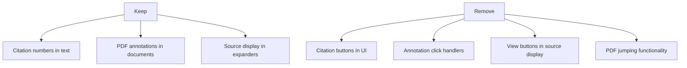

# Citation Button Removal Plan

## Overview

This document outlines a plan to remove the citation button functionality while keeping PDF annotations visible. The goal is to simplify the application by removing the citation jumping functionality that is not working correctly.

## Requirements

1. **Keep**:
   - Citation numbers in text (e.g., [1], [2]) for reference
   - PDF annotations highlighting content in documents
   - Source display in the expander section

2. **Remove**:
   - Citation buttons in the UI
   - PDF annotation jumping functionality
   - "View" buttons in source expander
   - Any interactive behavior related to annotation navigation

## Implementation Plan



### 1. Remove Citation Buttons from UI

**In app_modular.py:**

- **Remove citation button code block**
  - Location: After displaying the assistant's response (around line 830-850)
  - Action: Remove the entire code block that creates citation buttons below responses

```python
# REMOVE THIS BLOCK
if citation_numbers:
    st.markdown("**Jump to citation:** ", unsafe_allow_html=True)
    
    # Create a row of citation buttons
    cols = st.columns(min(len(citation_numbers), 10))
    
    for i, citation_num in enumerate(sorted(citation_numbers)):
        col_index = i % len(cols)
        with cols[col_index]:
            btn_key = f"citation_btn_{i}_{citation_num}"
            if st.button(f"[{citation_num}]", key=btn_key, 
                        help=f"Jump to source {citation_num} in PDF"):
                # Store the annotation index to scroll to
                st.session_state.selected_annotation_index = citation_num - 1
                # Force page rerun
                st.rerun()
```

- **Remove "View" buttons from source expander**
  - Location: In the source expander section (around line 850-870)
  - Action: Remove the View button from each source entry

```python
# REMOVE THIS CODE
with col2:
    st.write("")  # Add spacing
    # Add a button to navigate to this annotation
    if st.button("👁️ View", key=f"src_btn_{citation_num}", 
               help=f"Jump to source {citation_num} in PDF"):
        # Store the annotation index to scroll to
        st.session_state.selected_annotation_index = source_index
        # Force page rerun
        st.rerun()
```

### 2. Disable Annotation Click Handler

**In app_modular.py:**

- **Modify the annotation_click_handler function**
  - Location: Around line 300-340
  - Action: Replace the function with a simplified version that logs but doesn't navigate

```python
def annotation_click_handler(annotation):
    """Handle clicks on source annotations in the PDF viewer."""
    # Log the click but don't take any action
    page = annotation.get('page', 'unknown')
    print(f"Annotation clicked on page {page}: {annotation}")
    # No further action required
```

### 3. Remove PDF Viewer Navigation Parameters

**In app_modular.py:**

- **Modify the PDF viewer component**
  - Location: In the main UI layout section (around line 680-700)
  - Action: Remove the scroll_to_annotation parameter

```python
# FROM:
pdf_viewer(
    pdf_data,
    width=650,
    height=840,
    annotations=annotation_list,
    annotation_click_handler=annotation_click_handler,
    scroll_to_annotation=st.session_state.selected_annotation_index
)

# TO:
pdf_viewer(
    pdf_data,
    width=650,
    height=840,
    annotations=annotation_list,
    annotation_click_handler=annotation_click_handler
    # Remove scroll_to_annotation parameter
)
```

### 4. Keep but Simplify Session State Variables

**In src/utils.py:**

- **Keep the session state variables for compatibility**
  - Location: In the initialize_session_state function (around line 120-130)
  - Action: Keep the variables but make them inactive

```python
# KEEP BUT THEY ARE NOW UNUSED
if 'selected_annotation_index' not in st.session_state:
    st.session_state['selected_annotation_index'] = None

if 'highlighted_citation' not in st.session_state:
    st.session_state['highlighted_citation'] = None

if 'auto_expand_sources' not in st.session_state:
    st.session_state['auto_expand_sources'] = False
```

### 5. Remove Other Related Functionality

- **Remove any callback functions related to annotation jumping**
  - Location: Throughout app_modular.py
  - Action: Remove or disable functions like `citation_button_clicked`, `view_button_clicked`, etc.

- **Remove any expander auto-expansion code**
  - Location: Where sources are displayed (around line 850-860)
  - Action: Remove code that checks for 'auto_expand_sources'

```python
# REMOVE THIS CODE
# Check if we should auto-expand the sources
auto_expand = st.session_state.get('auto_expand_sources', False)
# Create the expander with the auto-expand setting
with st.expander("Source Information", expanded=auto_expand):
    # Reset the auto-expand flag after use
    if auto_expand:
        st.session_state.auto_expand_sources = False
```

### 6. Keep Source Display Code

**In app_modular.py:**

- **Keep the source information expander**
  - Location: Where sources are displayed
  - Action: Keep the basic expander functionality but remove all navigation elements

```python
# KEEP THIS CODE (BUT MODIFIED)
with st.expander("Source Information", expanded=False):
    for citation_num in sorted(citation_numbers):
        source_index = citation_num - 1  # Convert 1-based citation to 0-based index
        
        try:
            if source_index in displayed_sources:
                continue  # Skip if already displayed
            
            if source_index < len(response_data['sources']):
                source = response_data['sources'][source_index]
                
                # Display just the source header (no navigation button)
                st.markdown(f"### Source [{citation_num}]")
                
                # Format the source for display
                markdown, source_text = format_source_for_display(source, citation_num)
                # Extract just the content part (skip the header which we've already displayed)
                content_parts = markdown.split('\n')[1:]  # Skip the first line (header)
                st.markdown('\n'.join(content_parts))
                
                # Add to tracking set and sources list for history
                displayed_sources.add(source_index)
                sources.append(source_text)
                
                # Add horizontal rule between sources
                if citation_num != sorted(citation_numbers)[-1]:
                    st.markdown("---")
        except IndexError:
            st.warning(f"Citation [{citation_num}] does not match any available source.")
```

### 7. Keep Annotation Creation Code

**In src/source.py:**

- **Keep the annotation creation code**
  - Location: `create_annotations_from_sources` function (around line 95-160)
  - Action: No changes needed - we want to keep annotations visible in PDFs

## Testing Plan

After implementation, test the following:

1. **Basic Functionality**:
   - Chat responses should still include citation numbers in text
   - PDFs should still display annotations with red borders
   - Source expander should show all sources referenced in the response

2. **Removed Functionality**:
   - No citation buttons should appear below responses
   - No "View" buttons should appear in source entries
   - Clicking on PDF annotations should have no effect (or just log to console)

3. **Edge Cases**:
   - Multiple documents with annotations should work correctly
   - Large documents should display annotations properly
   - The application should still function correctly after removing this functionality

## Implementation Process

1. Back up the current code before making changes
2. Implement the changes in a development environment first
3. Test thoroughly before deploying to production
4. Update documentation to reflect that annotation jumping is no longer supported