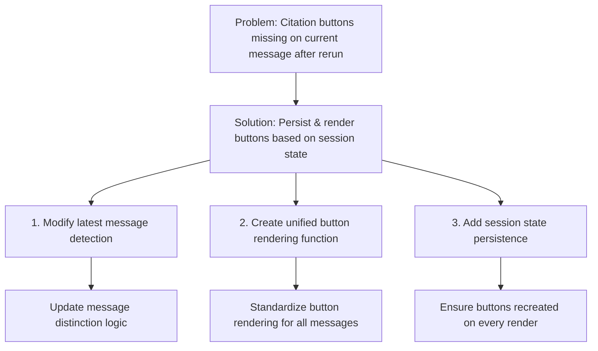

# Citation Button After Rerun Fix Plan

## Problem Analysis

After examining the code, I've identified the issue with citation buttons not showing up for the current message after a rerun:

1. Citation buttons for historical messages are rendered correctly (lines 865-907).
2. Citation buttons for the current message are created initially during response generation (lines 1017-1053).
3. After the assistant response is generated, the app calls `st.rerun()` in line 1170, which reruns the entire Streamlit app.
4. During this rerun, the latest message becomes part of chat history, but the logic in line 865 has a condition `if not is_latest_message` which prevents rendering citation buttons for the newest message.
5. The current message citation buttons code (lines 1017-1053) is not executed again after the rerun because we're no longer in the query processing flow.

In summary, the current implementation causes buttons to be lost during reruns, and no code path exists to recreate them for the latest message.

## Root Cause

The root cause is that the application has two separate code paths for rendering citation buttons:
1. One for historical messages in the chat history (which explicitly excludes the latest message)
2. One for the current message that only runs during initial response generation

After a rerun, the current message becomes part of the chat history, but neither code path renders its citation buttons.

## Solution Plan

Here's the plan to fix the citation buttons issue:



### Step 1: Modify Latest Message Detection Logic

Remove the specific exclusion of the latest message and instead use proper identification of message types:

```python
# Remove/modify this condition (line 865):
is_latest_message = (msg_idx == len(st.session_state.chat_history[current_file]) - 1)
if not is_latest_message and msg.get("citations") and is_for_current_document:
    # Button rendering code

# Replace with:
if msg.get("citations") and is_for_current_document:
    # New unified button rendering code
```

### Step 2: Create a Session State-Based Button Rendering Function

Update the button rendering approach to work for both current and historical messages:

```python
# For all messages in chat history (including the latest)
if msg.get("citations") and is_for_current_document:
    citation_numbers = msg.get("citations", [])
    citation_pages = msg.get("citation_pages", {})
    
    if citation_numbers:
        st.markdown("**Jump to citation:** ", unsafe_allow_html=True)
        cols = st.columns(min(len(citation_numbers), 10))
        
        for i, citation_num in enumerate(sorted(citation_numbers)):
            col_index = i % len(cols)
            
            # Get page number for this citation (if available)
            page_num = citation_pages.get(str(citation_num), 0)
            
            with cols[col_index]:
                # Create unique button key using message index and citation
                btn_key = f"citation_btn_{msg_idx}_{i}_{citation_num}"
                
                if page_num > 0:
                    if st.button(
                        f"[{citation_num}]",
                        key=btn_key,
                        help=f"Jump to page {page_num} in PDF"
                    ):
                        # Combine functionality of both handlers
                        st.session_state.scroll_to_page = page_num
                        print(f"Citation {citation_num} clicked: scrolling to page {page_num}")
                else:
                    # For citations without page info, use annotation index
                    if st.button(
                        f"[{citation_num}]",
                        key=btn_key,
                        help=f"Jump to source {citation_num} in PDF"
                    ):
                        st.session_state.selected_annotation_index = citation_num - 1
                        print(f"Citation {citation_num} clicked: setting annotation index {citation_num - 1}")
```

### Step 3: Remove Redundant Citation Button Code

Remove the duplicate citation button rendering code that runs only during initial response generation (lines 1017-1053), as our unified approach will handle all cases.

### Step 4: Update Session State Management 

Ensure citation information is properly stored in session state and persists between reruns:

```python
# This is already happening in lines 1160-1162, no changes needed
chat_message = {
    # ...existing code...
    "citations": st.session_state.current_response_citations,
    "citation_pages": st.session_state.current_citation_pages,
    # ...existing code...
}
```

## Expected Results

After implementing these changes:

1. Citation buttons will appear for all messages, including the current message, on every render
2. No distinction between "historical" and "current" messages will be needed for button rendering
3. Buttons will persist after reruns because they're rendered based on session state
4. Navigation to the correct source will work consistently for all messages

## Implementation Steps

1. Modify the historical message button rendering code (around line 865)
2. Remove the conditional check that excludes the latest message
3. Implement the updated button rendering logic
4. Remove the redundant citation button rendering code (lines 1017-1053)
5. Test the application to verify citation buttons appear for all messages

## Testing Strategy

1. Submit a query to generate a response with citations
2. Verify citation buttons appear in the response
3. Click on a citation button to navigate to the source
4. Submit another query and verify that citation buttons appear on both the previous and current messages
5. Refresh the page and verify all citation buttons are still present