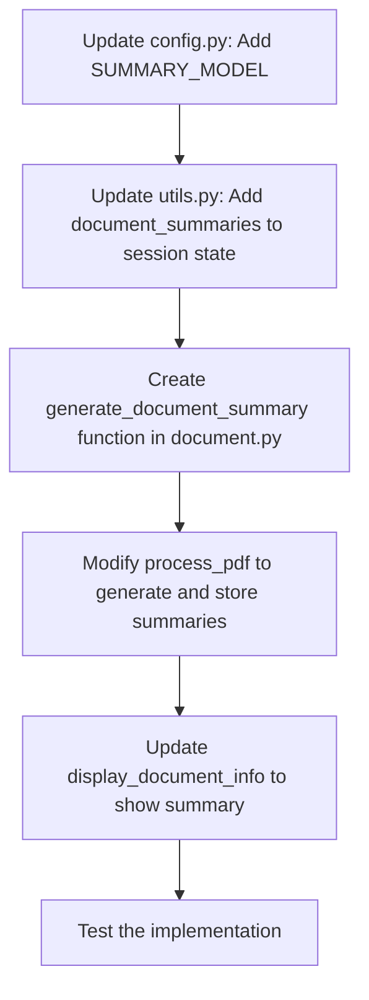

# Document Summary Implementation Plan

## Overview
Implement automatic document summarization using the `SUMMARY_MODEL` variable from `.env` file. The summary will be generated during document processing and displayed in the Document Info tab.

## Implementation Steps

### 1. Update config.py to read SUMMARY_MODEL

```python
# In src/config.py - add after MODELS definition

# Load summary model from environment variable, fallback to DEFAULT_MODEL
SUMMARY_MODEL = os.environ.get("SUMMARY_MODEL", DEFAULT_MODEL)
```

### 2. Add document_summaries to session state initialization

```python
# In src/utils.py - add to initialize_session_state function

if 'document_summaries' not in st.session_state:
    st.session_state['document_summaries'] = {}
```

### 3. Create a document summary function in document.py

```python
# In src/document.py - add new function

def generate_document_summary(documents, model_name):
    """
    Generate a summary of the document using the specified model.
    
    Args:
        documents: List of Llama Document objects
        model_name: Name of the model to use for summarization
        
    Returns:
        A string containing the document summary
    """
    # Extract text from documents (limit to first few docs for efficiency)
    sample_docs = documents[:min(3, len(documents))]
    sample_text = "\n\n".join([doc.text for doc in sample_docs])
    
    # Limit text length to avoid token limits
    max_chars = 5000
    if len(sample_text) > max_chars:
        sample_text = sample_text[:max_chars] + "..."
    
    from llama_index.llms.openai import OpenAI
    
    try:
        # Initialize the LLM with the summary model
        llm = OpenAI(model=model_name)
        
        # Create a prompt for summarization
        prompt = f"""
        Please provide a concise summary of the following document.
        Focus on the main topics, key findings, and overall purpose.
        Format the summary as 3-5 sentences of clear, informative text.
        
        DOCUMENT:
        {sample_text}
        
        SUMMARY:
        """
        
        # Generate the summary
        response = llm.complete(prompt)
        return response.text.strip()
    except Exception as e:
        print(f"Error generating document summary: {e}")
        return "Summary generation failed. Please try again later."
```

### 4. Modify process_pdf to generate and store summaries

```python
# In src/document.py - modify process_pdf function
# Add these imports at the top if not already there
from .config import SUMMARY_MODEL

# Add at the end of the process_pdf function, before the return statement:

    # Generate document summary if SUMMARY_MODEL is specified
    try:
        summary = generate_document_summary(llama_documents, SUMMARY_MODEL)
        # Store the summary in session state
        st.session_state['document_summaries'][pdf_id] = summary
        print(f"Generated summary for document {pdf_id}")
    except Exception as e:
        print(f"Failed to generate summary: {e}")
    
    return multi_index, keyword_index, pdf_id
```

### 5. Update display_document_info to show the summary

```python
# In app_modular.py - modify display_document_info function
# Add this after the title/author/keywords section but before the page count:

    # Display summary if available
    doc_id = st.session_state.file_document_id.get(file_name)
    if doc_id and doc_id in st.session_state.get('document_summaries', {}):
        st.markdown("### Summary")
        summary = st.session_state['document_summaries'][doc_id]
        st.markdown(f"{summary}")
        st.markdown("---")
```

## Implementation Flow



## Technical Considerations

1. **Error Handling**: The implementation includes try/except blocks to handle potential API errors.
2. **Efficiency**: 
   - We limit the text used for summarization to the first few documents and a maximum character length
   - This prevents token limit issues and reduces API costs
3. **User Experience**: 
   - Summary appears in the Document Info tab right after the metadata
   - Clean formatting with section headers and dividers
4. **State Management**: 
   - Summaries are stored in the session state to persist between interactions
   - Indexed by document ID for reliable retrieval