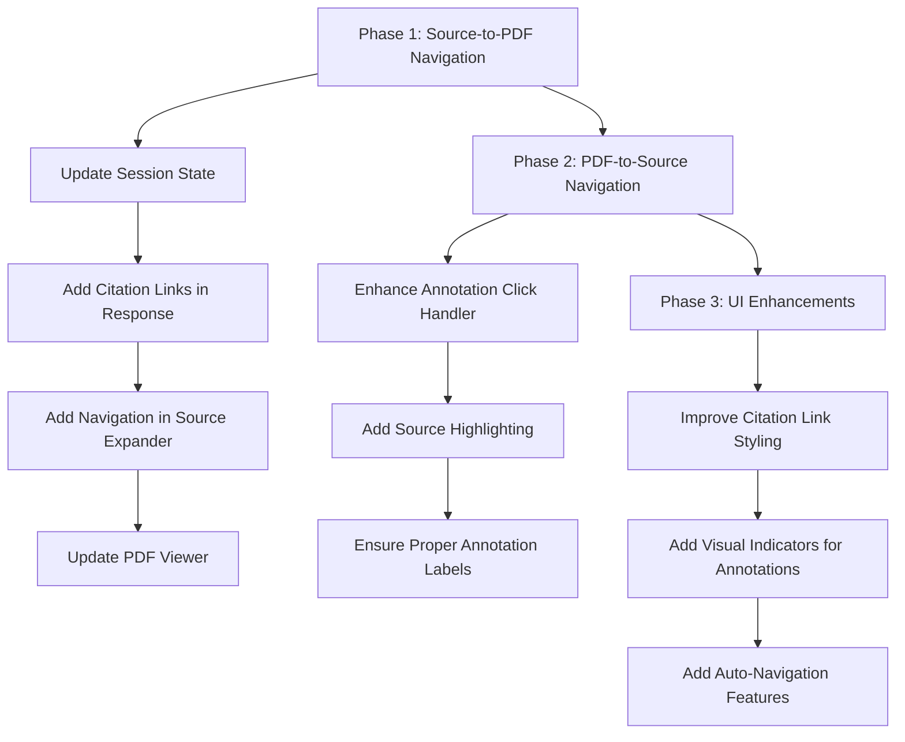

# PDF Annotation Clickable Links - Phased Implementation Plan

## Overview
This plan outlines a phased approach to implement clickable links between source citations and PDF annotations in the Chat with Docs application. We'll use hyperlinks where possible and implement the features incrementally to minimize risks.

## Requirements

1. Make both citation numbers in response text and sources in expander clickable
2. Use hyperlinks rather than buttons where possible
3. Use only Streamlit's native functionality and pdf_viewer parameters
4. Don't automatically expand the source expander when an annotation is clicked

## Phase 1: Basic Source-to-PDF Navigation (Essential)

In this phase, we'll implement the core functionality of clicking on source citations to navigate to the corresponding annotation in the PDF.

### 1.1 Update Session State to Track Selected Annotations

First, add a variable to track which annotation should be displayed:

```python
# Add to initialize_session_state() in src/utils.py
if 'selected_annotation_index' not in st.session_state:
    st.session_state.selected_annotation_index = None
```

### 1.2 Create Hyperlink Mechanism for Citations in Response

Since Streamlit doesn't natively support HTML hyperlinks that trigger Python code, we'll create a hyperlink-style solution using Streamlit components:

```python
# In app_modular.py where the response is displayed (around line 795)
# After displaying the main response
st.markdown(response_data['answer'])

# Extract citation numbers from the response
citation_numbers = extract_citation_indices(response_data['answer'])

# If citations exist, add clickable links
if citation_numbers:
    st.markdown("**Citations:** ", unsafe_allow_html=True)
    
    # Create a horizontal row of citation links
    cols = st.columns(min(len(citation_numbers), 10))  # Limit to 10 columns max
    
    for i, citation_num in enumerate(sorted(citation_numbers)):
        col_index = i % len(cols)
        with cols[col_index]:
            # Use a small link-styled button
            if st.button(f"[{citation_num}]", key=f"citation_link_{citation_num}", 
                       help=f"Jump to source {citation_num} in PDF",
                       type="secondary", use_container_width=False):
                # Store the annotation index (0-based) to scroll to
                st.session_state.selected_annotation_index = citation_num - 1
                # Force page rerun
                st.rerun()
```

### 1.3 Create Hyperlink-Style Navigation in Source Expander

Add clickable elements to the source expander entries:

```python
# In app_modular.py where sources are displayed in the expander (around line 810)
with st.expander("Source Information"):
    for citation_num in sorted(citation_numbers):
        source_index = citation_num - 1
        
        try:
            if source_index in displayed_sources:
                continue  # Skip if already displayed
            
            if source_index < len(response_data['sources']):
                source = response_data['sources'][source_index]
                
                # Extract source information
                if hasattr(source, 'node'):
                    page_num = source.node.metadata.get('page', 'N/A')
                    text = source.node.text.strip()
                elif hasattr(source, 'metadata') and hasattr(source, 'text'):
                    page_num = source.metadata.get('page', 'N/A')
                    text = source.text.strip()
                else:
                    page_num = 'Unknown'
                    text = str(source) if source is not None else 'No text available'
                
                # Create a header with citation number and a link-styled button for navigation
                col1, col2 = st.columns([5, 1])
                
                with col1:
                    st.markdown(f"### Source [{citation_num}]")
                    st.markdown(f"**Page:** {page_num}")
                
                with col2:
                    st.write("")  # Add spacing
                    st.write("")  # Add spacing
                    # Create a small link-styled button for navigation
                    if st.button("📄 View in PDF", key=f"src_link_{citation_num}", 
                              help=f"Jump to source {citation_num} in PDF",
                              type="secondary", use_container_width=True):
                        # Store the annotation index to scroll to
                        st.session_state.selected_annotation_index = source_index
                        # Force page rerun
                        st.rerun()
                
                # Display the source text
                st.markdown(f"**Text:**\n```\n{text}\n```")
                
                # Add to tracking set and sources list for history
                displayed_sources.add(source_index)
                sources.append(f"Source [{citation_num}] (Page {page_num}):\n{text}")
                
                # Add horizontal rule between sources
                if citation_num != sorted(citation_numbers)[-1]:
                    st.markdown("---")
        except IndexError:
            st.warning(f"Citation [{citation_num}] does not match any available source.")
```

### 1.4 Update PDF Viewer to Use the Selected Annotation

Modify the PDF viewer to navigate to selected annotations:

```python
# In both PDF viewer sections (around line 661 and line 696)
pdf_viewer(
    input=pdf_binary,
    annotations=annotations,
    annotation_outline_size=5,  # Make outlines more visible
    height=800,
    on_annotation_click=annotation_click_handler,
    # Add scroll_to_annotation parameter to navigate to the selected annotation
    scroll_to_annotation=st.session_state.get('selected_annotation_index')
)

# Clear the selected annotation after the PDF viewer is rendered
# This prevents auto-scrolling on subsequent page loads
if st.session_state.get('selected_annotation_index') is not None:
    st.session_state.selected_annotation_index = None
```

## Phase 2: PDF-to-Source Navigation

In this phase, we'll implement the reverse functionality where clicking on an annotation in the PDF highlights the corresponding source.

### 2.1 Enhance the Annotation Click Handler

Update the annotation click handler to identify which source was clicked:

```python
def annotation_click_handler(annotation):
    """Handle clicks on source annotations in the PDF viewer."""
    st.session_state.last_clicked_annotation = annotation
    page = annotation.get('page', 'unknown')
    print(f"Annotation clicked on page {page}: {annotation}")
    
    # Try to extract citation number from the annotation
    citation_num = None
    if 'title' in annotation and annotation['title'].startswith('Source ['):
        # Extract citation number from "Source [X]"
        match = re.search(r'\[(\d+)\]', annotation['title'])
        if match:
            citation_num = int(match.group(1))
    elif 'label' in annotation and annotation['label'].startswith('['):
        # Extract citation number from "[X]"
        match = re.search(r'\[(\d+)\]', annotation['label'])
        if match:
            citation_num = int(match.group(1))
    
    # Store the clicked citation for highlighting in UI
    if citation_num:
        st.session_state.highlighted_citation = citation_num
        # Force a page rerun to highlight the corresponding source
        # Don't auto-expand the expander (per requirements)
        st.rerun()
```

### 2.2 Add Highlighting for Clicked Sources

Add logic to highlight sources that correspond to clicked annotations:

```python
# In the source display section, add conditional highlighting
# Before displaying the source content:

# Check if this source should be highlighted (from a clicked annotation)
if st.session_state.get('highlighted_citation') == citation_num:
    # Use a success message to highlight this source
    st.success(f"⭐ This source was referenced in the PDF")
    # Reset the highlight after displaying
    st.session_state.highlighted_citation = None
```

### 2.3 Ensure Annotations Have Proper Labels

Modify the `create_annotations_from_sources()` function to ensure annotations are properly labeled:

```python
def create_annotations_from_sources(answer_text, sources):
    """
    Create PDF annotations from sources that are cited in the answer text.
    
    Args:
        answer_text: The answer text containing citations
        sources: List of source nodes
        
    Returns:
        A list of annotation dictionaries
    """
    citations = extract_citation_indices(answer_text)
    annotations = []
    
    for idx in citations:
        if idx <= len(sources):
            source = sources[idx-1]  # Convert 1-based citation to 0-based index
            
            # Extract page number from source based on the source type
            page_num = None
            if hasattr(source, 'node'):
                page_num = source.node.metadata.get('page', 0)
            elif hasattr(source, 'metadata') and hasattr(source, 'text'):
                page_num = source.metadata.get('page', 0)
            
            # Only create annotation if we have a valid page number
            if page_num is not None:
                try:
                    # Convert page to integer if possible
                    page_num = int(page_num)
                except (ValueError, TypeError):
                    # Use 0 as fallback if conversion fails
                    page_num = 0
                
                # Create a border annotation for the page based on the citation
                annotation = {
                    "page": page_num,
                    "x": 10,             # Small margin from left edge
                    "y": 10,             # Small margin from top edge
                    "width": 580,        # Wide enough to be clearly visible
                    "height": 800,       # Tall enough to frame content
                    "color": "red",      # Red border
                    "title": f"Source [{idx}]",  # Add citation number as title
                    "label": f"[{idx}]"  # Add label for identification
                }
                
                # Add the annotation
                annotations.append(annotation)
    
    return annotations
```

## Phase 3: UI Enhancements and Refinements

In this phase, we'll make UI improvements and add additional features to enhance the user experience.

### 3.1 Improve Citation Link Styling in Response Text

Try improving the layout and styling of citation links:

```python
# Instead of a separate row of citation links below the response,
# This approach creates a cleaner horizontal set of links
if citation_numbers:
    citation_links = []
    for citation_num in sorted(citation_numbers):
        # Create a small button for each citation
        citation_links.append(f'<span style="margin-right:8px"><a href="#" id="citation-{citation_num}" data-citation="{citation_num}">📄[{citation_num}]</a></span>')
    
    link_html = "**Sources in text:** " + "".join(citation_links)
    st.markdown(link_html, unsafe_allow_html=True)
    
    # Use streamlit_js_eval to handle clicks
    # Note: This requires the streamlit-js-eval package
    from streamlit_js_eval import streamlit_js_eval
    
    clicked_citation = streamlit_js_eval(
        """
        // Get all citation links
        const links = document.querySelectorAll('[id^="citation-"]');
        
        // Add click event listeners to each link
        links.forEach(link => {
            link.addEventListener('click', function(e) {
                e.preventDefault();
                const citation = this.getAttribute('data-citation');
                window.parent.postMessage({type: 'streamlit:setComponentValue', value: citation}, '*');
            });
        });
        
        // Return null if no link was clicked yet
        return null;
        """,
        key="citation_links"
    )
    
    # If a citation was clicked, update the selected annotation
    if clicked_citation and clicked_citation != "null":
        st.session_state.selected_annotation_index = int(clicked_citation) - 1
        st.rerun()
```

### 3.2 Add Visual Indicators for Clickable Annotations

Add visual indicators to make annotations more obviously clickable:

```python
def create_annotations_from_sources(answer_text, sources):
    # Existing code...
    
    # Create a border annotation for the page based on the citation
    annotation = {
        "page": page_num,
        "x": 10,             # Small margin from left edge
        "y": 10,             # Small margin from top edge
        "width": 580,        # Wide enough to be clearly visible
        "height": 800,       # Tall enough to frame content
        "color": "red",      # Red border
        "title": f"Source [{idx}] - Click to highlight",  # More explicit title
        "label": f"[{idx}]"  # Add label for identification
    }
    
    # Add a small clickable indicator with citation number in top-right corner
    # This makes it more obvious that the annotation is clickable
    citation_badge = {
        "page": page_num,
        "x": 550,            # Position in top-right
        "y": 20,
        "width": 40,
        "height": 30,
        "color": "red",
        "title": f"Source [{idx}]",
        "label": f"[{idx}]"
    }
    
    annotations.append(annotation)
    annotations.append(citation_badge)
    
    # Rest of code...
```

### 3.3 Add Jump to Citation After Query Response

Automatically navigate to the first citation when a new response is generated:

```python
# In the section where a new response is generated (around line 860)
# After adding the chat message to history

# Optionally, auto-navigate to the first citation in the response
if 'sources' in response_data and response_data['sources'] and extract_citation_indices(response_data['answer']):
    # Get the first citation number
    first_citation = min(extract_citation_indices(response_data['answer']))
    # Set up navigation to this citation's annotation
    st.session_state.selected_annotation_index = first_citation - 1
```

## Implementation Flow



## Phase 1 Testing Checklist

- [ ] Session state correctly tracks selected annotation
- [ ] Citation links appear below response text
- [ ] Clicking a citation link navigates to the correct annotation
- [ ] Navigation buttons in the source expander work correctly
- [ ] PDF viewer scrolls to the selected annotation
- [ ] Annotation selection is cleared after navigation

## Phase 2 Testing Checklist

- [ ] Clicking an annotation in the PDF correctly identifies the citation number
- [ ] Clicked sources are highlighted in the source expander (without auto-expanding)
- [ ] Annotations have proper titles and labels for identification
- [ ] Navigation works in both directions (source-to-PDF and PDF-to-source)

## Phase 3 Testing Checklist

- [ ] Citation links have improved styling
- [ ] Annotations have clear visual indicators of clickability
- [ ] Optional auto-navigation features work correctly
- [ ] All UI elements are consistent and intuitive