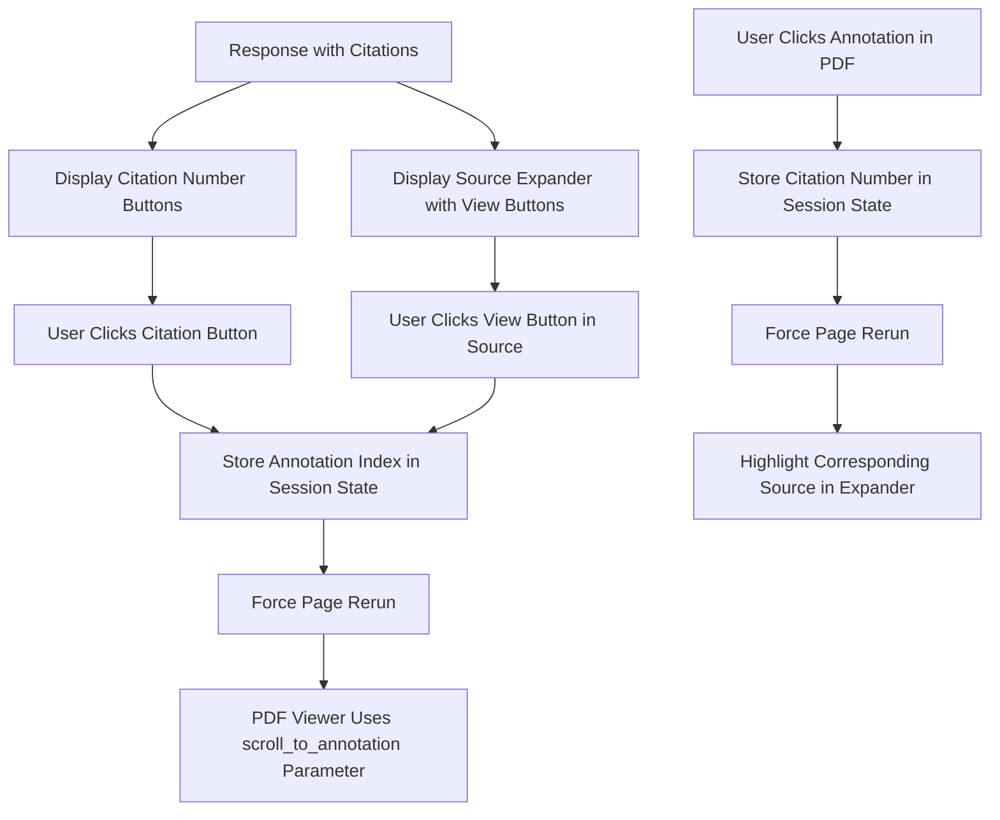

# PDF Annotation Clickable Links Simplified Implementation Plan

## Overview
This plan outlines how to implement clickable links between source citations and PDF annotations in the Chat with Docs application using only native Streamlit components and the pdf_viewer parameters, avoiding JavaScript.

## Requirements

1. Make both citation numbers in the response text and sources in the expander clickable
2. Use only Streamlit's native functionality and pdf_viewer parameters
3. Clicking a source should scroll to the corresponding annotation in the PDF
4. Clickable elements should appear as hyperlinks

## Implementation Steps

### 1. Update Session State to Track Selected Annotations

Add variables to track which annotation should be displayed when the PDF viewer is rendered:

```python
# Add to initialize_session_state() in src/utils.py
if 'selected_annotation_index' not in st.session_state:
    st.session_state.selected_annotation_index = None
```

### 2. Enhance the Source Display in the Expander

Modify the source display code to include clickable elements for each source:

```python
# In app_modular.py where sources are displayed in the expander (around line 810)
with st.expander("Source Information"):
    for citation_num in sorted(citation_numbers):
        source_index = citation_num - 1
        
        try:
            if source_index in displayed_sources:
                continue  # Skip if already displayed
            
            if source_index < len(response_data['sources']):
                source = response_data['sources'][source_index]
                
                # Extract source information
                if hasattr(source, 'node'):
                    page_num = source.node.metadata.get('page', 'N/A')
                    text = source.node.text.strip()
                elif hasattr(source, 'metadata') and hasattr(source, 'text'):
                    page_num = source.metadata.get('page', 'N/A')
                    text = source.text.strip()
                else:
                    page_num = 'Unknown'
                    text = str(source) if source is not None else 'No text available'
                
                # Create the source header with a clickable link
                col1, col2 = st.columns([4, 1])
                
                with col1:
                    st.markdown(f"### Source [{citation_num}]")
                    st.markdown(f"**Page:** {page_num}")
                
                with col2:
                    # Add a button to navigate to this annotation
                    if st.button("👁️ View", key=f"src_btn_{citation_num}"):
                        # Store the annotation index to scroll to
                        st.session_state.selected_annotation_index = source_index
                        # Force page rerun
                        st.rerun()
                
                # Display the source text
                st.markdown(f"**Text:**\n```\n{text}\n```")
                
                # Add to tracking set and sources list for history
                displayed_sources.add(source_index)
                sources.append(f"Source [{citation_num}] (Page {page_num}):\n{text}")
                
                # Add horizontal rule between sources
                if citation_num != sorted(citation_numbers)[-1]:
                    st.markdown("---")
        except IndexError:
            st.warning(f"Citation [{citation_num}] does not match any available source.")
```

### 3. Add Clickable Citation Numbers Below Response Text

Add clickable citation numbers directly below the assistant's response:

```python
# In app_modular.py where the response is displayed (around line 795)
# After displaying the main response
st.markdown(response_data['answer'])

# Extract citation numbers from the response
citation_numbers = extract_citation_indices(response_data['answer'])

# If citations exist, add clickable links
if citation_numbers:
    st.markdown("**Jump to citation:** ", unsafe_allow_html=True)
    
    # Create a row of citation buttons
    cols = st.columns(min(len(citation_numbers), 10))  # Limit to 10 columns max
    
    for i, citation_num in enumerate(sorted(citation_numbers)):
        col_index = i % len(cols)
        with cols[col_index]:
            if st.button(f"[{citation_num}]", key=f"citation_btn_{citation_num}"):
                # Store the annotation index (0-based) to scroll to
                st.session_state.selected_annotation_index = citation_num - 1
                # Force page rerun
                st.rerun()
```

### 4. Update PDF Viewer Implementation

Modify the PDF viewer to use the selected annotation for scrolling:

```python
# In both PDF viewer sections (around line 661 and line 696)
pdf_viewer(
    input=pdf_binary,
    annotations=annotations,
    annotation_outline_size=5,  # Make outlines more visible
    height=800,
    on_annotation_click=annotation_click_handler,
    # Add scroll_to_annotation parameter to navigate to the selected annotation
    scroll_to_annotation=st.session_state.get('selected_annotation_index')
)

# Clear the selected annotation after the PDF viewer is rendered
# This prevents auto-scrolling on subsequent page loads
if st.session_state.get('selected_annotation_index') is not None:
    st.session_state.selected_annotation_index = None
```

### 5. Enhance the Annotation Click Handler

Update the annotation click handler to highlight the corresponding source when an annotation is clicked:

```python
def annotation_click_handler(annotation):
    """Handle clicks on source annotations in the PDF viewer."""
    st.session_state.last_clicked_annotation = annotation
    page = annotation.get('page', 'unknown')
    print(f"Annotation clicked on page {page}: {annotation}")
    
    # Try to extract citation number from the annotation
    citation_num = None
    if 'title' in annotation and annotation['title'].startswith('Source ['):
        # Extract citation number from "Source [X]"
        match = re.search(r'\[(\d+)\]', annotation['title'])
        if match:
            citation_num = int(match.group(1))
    elif 'label' in annotation and annotation['label'].startswith('['):
        # Extract citation number from "[X]"
        match = re.search(r'\[(\d+)\]', annotation['label'])
        if match:
            citation_num = int(match.group(1))
    
    # Store the clicked citation for highlighting in UI
    if citation_num:
        st.session_state.highlighted_citation = citation_num
        # Force a page rerun to highlight the corresponding source
        st.rerun()
```

### 6. Add Highlighting for Clicked Sources

Add logic to highlight sources that correspond to clicked annotations:

```python
# In the source display section, add conditional highlighting
# Inside the source display loop, before displaying the source header:

# Check if this source should be highlighted (from a clicked annotation)
if st.session_state.get('highlighted_citation') == citation_num:
    # Add a highlighted box around this source
    st.info(f"⭐ This source was referenced in the PDF viewer")
    # Reset the highlight after displaying
    st.session_state.highlighted_citation = None
```

### 7. Ensure Annotations Have Proper Labels

Modify the `create_annotations_from_sources()` function to ensure annotations have proper labels for identification:

```python
def create_annotations_from_sources(answer_text, sources):
    """
    Create PDF annotations from sources that are cited in the answer text.
    
    Args:
        answer_text: The answer text containing citations
        sources: List of source nodes
        
    Returns:
        A list of annotation dictionaries
    """
    citations = extract_citation_indices(answer_text)
    annotations = []
    
    for idx in citations:
        if idx <= len(sources):
            source = sources[idx-1]  # Convert 1-based citation to 0-based index
            
            # Extract page number from source based on the source type
            page_num = None
            if hasattr(source, 'node'):
                page_num = source.node.metadata.get('page', 0)
            elif hasattr(source, 'metadata') and hasattr(source, 'text'):
                page_num = source.metadata.get('page', 0)
            
            # Only create annotation if we have a valid page number
            if page_num is not None:
                try:
                    # Convert page to integer if possible
                    page_num = int(page_num)
                except (ValueError, TypeError):
                    # Use 0 as fallback if conversion fails
                    page_num = 0
                
                # Create a border annotation for the page based on the citation
                annotation = {
                    "page": page_num,
                    "x": 10,             # Small margin from left edge
                    "y": 10,             # Small margin from top edge
                    "width": 580,        # Wide enough to be clearly visible
                    "height": 800,       # Tall enough to frame content
                    "color": "red",      # Red border
                    "title": f"Source [{idx}]",  # Add citation number as title
                    "label": f"[{idx}]"  # Add label for identification
                }
                
                # Add the annotation
                annotations.append(annotation)
    
    return annotations
```

## Testing Plan

1. **Basic Navigation Flow**:
   - Generate a response with citations
   - Click on a citation number button below the response
   - Verify the PDF viewer scrolls to the correct annotation
   - Click on the "View" button in a source expander
   - Verify the PDF viewer scrolls to the correct annotation
   - Click on an annotation in the PDF viewer
   - Verify the corresponding source is highlighted in the expander

2. **Multiple Document Support**:
   - Test with multiple documents loaded
   - Ensure navigation works correctly for each document independently
   - Verify annotations and navigation state are document-specific

3. **Edge Cases**:
   - Test with sources that don't have valid page numbers
   - Test with very long documents with many citations
   - Test with multiple citations referring to the same page

## Implementation Flow



## Benefits of This Approach

1. Uses only native Streamlit components (no JavaScript)
2. Utilizes the built-in capabilities of the pdf_viewer component
3. Creates a bidirectional navigation experience between sources and annotations
4. Preserves the document-specific response system
5. Works with the existing annotation creation system