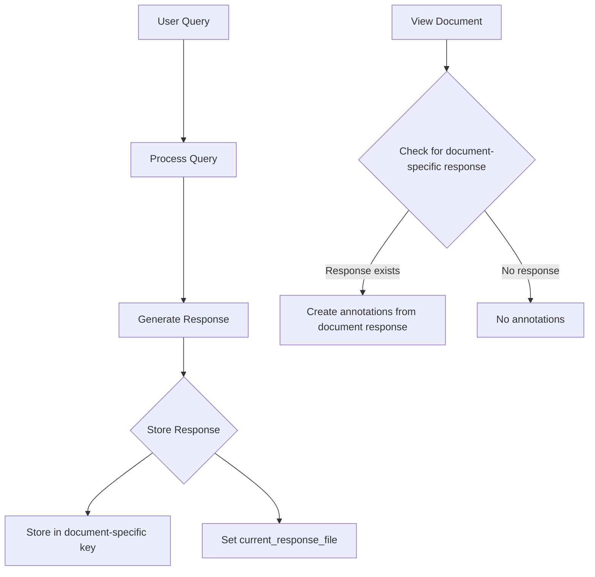

# PDF Annotation Per Document Implementation Plan

## Issue Summary

Currently, when a new document is loaded, annotations from the previous document are still being displayed. This happens because:

1. The application uses a global `st.session_state.response` variable to store the current response.
2. When switching between documents, this single response is used for annotation creation across all documents.
3. The `current_response_file` variable that's supposed to track which document the response belongs to isn't functioning correctly.

## Solution Architecture

We'll implement a document-specific response storage system that ensures annotations are only displayed for the document they belong to:



## Implementation Steps

### 1. Create Document-Specific Response Storage

Initialize a dictionary in the session state to store responses by document name:

```python
# Add to initialize_session_state() in utils.py
if 'document_responses' not in st.session_state:
    st.session_state.document_responses = {}
```

### 2. Update Response Storage Logic

Modify how responses are stored after processing a query:

```python
# Replace in app_modular.py (around line 779)
# Current implementation:
st.session_state.response = response_data
                                
# New implementation:
st.session_state.document_responses[current_file] = response_data
st.session_state.current_response_file = current_file
```

### 3. Update Annotation Creation Logic

Modify the PDF viewer sections to use document-specific responses:

```python
# Replace in app_modular.py (around lines 630-647 and similar block around 667-683)
# Current implementation:
if ('response' in st.session_state and
    st.session_state.response and
    'sources' in st.session_state.response and
    'current_response_file' in st.session_state and
    st.session_state.get('current_response_file') == current_file):
    
    # Create annotations based on the answer and sources
    annotations = create_annotations_from_sources(
        st.session_state.response['answer'],
        st.session_state.response['sources']
    )

# New implementation:
if (current_file in st.session_state.document_responses and
    st.session_state.document_responses[current_file] and
    'sources' in st.session_state.document_responses[current_file]):
    
    # Create annotations based on document-specific response
    doc_response = st.session_state.document_responses[current_file]
    annotations = create_annotations_from_sources(
        doc_response['answer'],
        doc_response['sources']
    )
```

### 4. Update Document Deletion Logic

Ensure document-specific responses are cleaned up when documents are deleted:

```python
# Add to document deletion code (around line 490)
if doc_name in st.session_state.document_responses:
    del st.session_state.document_responses[doc_name]
```

## Testing Plan

1. **Basic Functionality Test**:
   - Upload two documents
   - Query the first document and verify annotations appear
   - Switch to the second document and verify no annotations appear
   - Query the second document and verify correct annotations appear
   - Switch back to first document and verify its annotations are preserved

2. **Edge Cases**:
   - Delete a document and verify its responses/annotations are cleaned up
   - Clear chat for a document and verify it doesn't affect other documents
   - Test with various response formats (with/without citations)

## Expected Results

- Each document will only display annotations from queries made against that specific document


## Update: Streamlit Refresh Issue

**2025-03-21 15:44:00**

During testing, we discovered that while the document-specific response storage is working correctly, Streamlit does not automatically refresh the PDF viewer component with the new annotations after a response is generated. The annotations only appear when Streamlit re-renders on the next user interaction (e.g., when typing a new question).

### Solution Options

1. **Force a page rerun**: After storing the response, use `st.rerun()` to force Streamlit to fully refresh the page, which would display the annotations immediately.

2. **Use experimental containers with empty**: Create a container for the PDF viewer and use `container.empty()` before redisplaying it with annotations.

3. **Add a temporary state variable**: Add a state variable that triggers after a response is generated, forcing Streamlit to re-render the PDF viewer section.

The most straightforward solution is #1 - using `st.rerun()` after storing the response.
- Switching between documents will show the correct annotations for each document
- Annotations will persist per document until chat is cleared or document is deleted