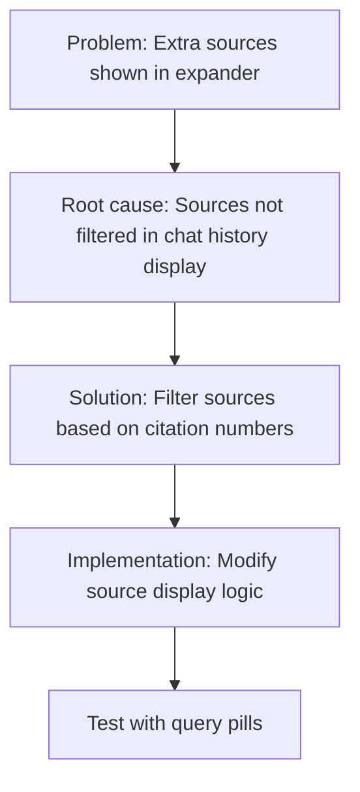

# Query Pill Citation Sources Fix Plan

## Problem Statement

When using query suggestion pills, the sources shown in the expander include Source [2], Source [3], etc., even when the answer doesn't actually contain those citation numbers in the text. This creates confusion for users who see sources referenced that don't match the citations in the actual response.

## Issue Analysis

Based on code review, I've identified the root cause of this issue:

1. **Different Code Paths**: 
   - Regular chat queries and query pills follow different processing paths
   - The query pill path (lines 793-919) processes responses and then triggers a `rerun()`
   - After rerun, the message appears in chat history with a different source display logic

2. **Source Display Logic Mismatch**:
   - Initial response generation (lines 1062-1096) properly filters sources based on citation numbers
   - But chat history display (lines 939-946) shows all sources without filtering by citation numbers
   - This causes extra sources to appear in the expander even when not cited in the text

3. **Source-Citation Indexing Issue**:
   - When sources are stored in chat history, they're stored as a flat list
   - There's no direct mapping between source index and citation number
   - This means Source [2] might not correspond to the second element in the sources list

## Solution Plan

The solution is to modify how sources are displayed in the chat history to ensure only cited sources are shown:



### Implementation Details

1. **Modify the Source Display Logic** in the chat history section (around line 939):

```python
# Current code:
if msg.get("sources"):
    # Add a heading for Sources before the expander
    with st.expander("Show Sources"):
        # Display sources with consistent simple formatting
        for i, source_text in enumerate(msg["sources"]):
            st.write(source_text)
            if i < len(msg["sources"]) - 1:
                st.markdown("---")

# Modified code:
if msg.get("sources"):
    # Add a heading for Sources before the expander
    with st.expander("Show Sources"):
        # Get citation numbers for this message
        citation_numbers = msg.get("citations", [])
        
        if citation_numbers:
            # Only display sources that are actually cited in the response
            displayed_sources = set()
            
            for citation_num in sorted(citation_numbers):
                source_index = citation_num - 1  # Convert 1-based citation to 0-based index
                
                if source_index in displayed_sources:
                    continue  # Skip if already displayed this source
                
                if source_index < len(msg["sources"]):
                    st.markdown(f"**Source [{citation_num}]**")
                    st.write(msg["sources"][source_index])
                    displayed_sources.add(source_index)
                    
                    # Add separator between sources
                    if citation_num != sorted(citation_numbers)[-1]:
                        st.markdown("---")
        else:
            # Fallback: If no citations found, show all sources
            for i, source_text in enumerate(msg["sources"]):
                st.write(source_text)
                if i < len(msg["sources"]) - 1:
                    st.markdown("---")
```

2. **Ensure Consistent Source Storage** when processing pills (around line 879-886):

```python
# Make sure source formatting is consistent between initial display and history display
formatted_sources = []
for i, source in enumerate(response_data['sources']):
    # Format each source with its citation number
    formatted_markdown, _ = format_source_for_display(source, i+1)
    formatted_sources.append(formatted_markdown)
```

3. **Map Citations to Sources Correctly** when storing in chat history:

```python
# When creating the chat message (around line 894):
chat_message = {
    # ... existing fields ...
    "sources": formatted_sources,
    # Ensure this maps to actual citation numbers used in the text:
    "citations": st.session_state.current_response_citations,
    # ... other fields ...
}
```

## Testing Strategy

1. **Query Pill Testing**:
   - Upload a document and wait for query pills to appear
   - Click on a query pill to generate a response
   - Verify that only the sources cited in the response are shown in the expander
   - Check that source numbers match citation numbers in the text
   - Repeat with multiple pills to ensure consistent behavior

2. **Regular Query Testing**:
   - Use the chat input to ask queries normally
   - Verify that source display still works correctly
   - Check that the fix doesn't break existing functionality

3. **Edge Cases**:
   - Test with responses that have no citations
   - Test with responses that cite the same source multiple times
   - Test with responses that have citations but reference missing sources

## Expected Results

After implementing this fix:
1. Only sources that are referenced with citation numbers in the response text should appear in the expander
2. Source numbering should match the citation numbers in the text
3. This should be consistent whether using query pills or normal chat input

## Implementation Steps

1. Modify the source display logic in the chat history section (around line 939-946)
2. Test the fix with query pills and regular chat input
3. Verify that source display is consistent with citations in the response