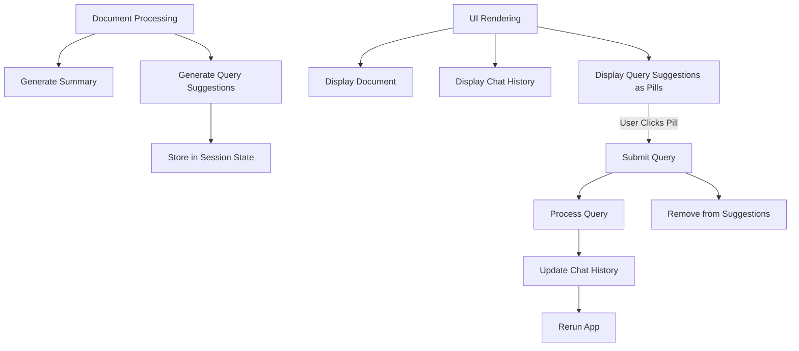

# Query Suggestions Implementation Plan

## Overview

This implementation plan outlines the process of adding query suggestions to the Chat with Docs application using Streamlit's pills component. The feature will automatically generate 3 query suggestions for each document, display them as clickable pills above the chat interface, and allow users to select them to immediately submit questions to the chat.

## Requirements

1. Generate 3 query suggestions automatically for each document using the SUMMARY_MODEL
2. Display suggestions as pills above the chat container
3. When a user clicks a pill, submit that query and remove it from available suggestions
4. Suggestions are fixed per document (generated once when first loaded)

## Implementation Steps

### 1. Add Query Suggestion Generation Function

Create a new function in `src/document.py` to generate query suggestions:

```python
def generate_query_suggestions(documents, model_name):
    """
    Generate query suggestions for a document using the specified model.
    
    Args:
        documents: List of Llama Document objects
        model_name: Name of the model to use
        
    Returns:
        A list of 3 query suggestions
    """
    # Extract text sample similar to summary generation
    sample_docs = documents[:min(3, len(documents))]
    sample_text = "\n\n".join([doc.text for doc in sample_docs])
    
    # Limit text length
    max_chars = 5000
    if len(sample_text) > max_chars:
        sample_text = sample_text[:max_chars] + "..."
    
    from llama_index.llms.openai import OpenAI
    
    try:
        # Initialize the LLM
        llm = OpenAI(model=model_name)
        
        # Create a prompt for generating queries
        prompt = f"""
        Please generate 3 interesting and diverse questions that someone might want to ask about the following document.
        Make the questions specific to the content and insightful.
        Format your response as a simple Python list with exactly 3 questions, each enclosed in quotes.
        Example format: ["Question 1?", "Question 2?", "Question 3?"]
        
        DOCUMENT:
        {sample_text}
        
        QUESTIONS:
        """
        
        # Generate the suggestions
        response = llm.complete(prompt)
        
        # Parse the response to get a list of questions
        import ast
        suggestions = ast.literal_eval(response.text.strip())
        
        # Ensure we have exactly 3 questions
        if len(suggestions) > 3:
            suggestions = suggestions[:3]
        elif len(suggestions) < 3:
            suggestions = suggestions + ["Tell me more about this document"] * (3 - len(suggestions))
            
        return suggestions
    except Exception as e:
        print(f"Error generating query suggestions: {e}")
        # Fallback suggestions
        return [
            "What is the main topic of this document?",
            "What are the key findings in this document?",
            "Summarize this document briefly."
        ]
```

### 2. Update Document Processing Function

Modify the `process_pdf` function in `src/document.py` to generate and store suggestions:

```python
# Add this after the summary generation section in process_pdf
try:
    # Generate query suggestions
    print(f"Generating query suggestions using {SUMMARY_MODEL} model...")
    suggestions = generate_query_suggestions(llama_documents, SUMMARY_MODEL)
    
    # Initialize suggestions dict if not exists
    if 'document_query_suggestions' not in st.session_state:
        st.session_state['document_query_suggestions'] = {}
    
    # Store the suggestions in session state
    st.session_state['document_query_suggestions'][pdf_id] = suggestions
    print(f"Generated query suggestions for document {pdf_id}")
except Exception as e:
    print(f"Failed to generate query suggestions: {e}")
```

### 3. Update Session State Initialization

Modify the `initialize_session_state` function in `src/utils.py` to initialize the query suggestions dictionary:

```python
# Add this to the initialize_session_state function
if 'document_query_suggestions' not in st.session_state:
    st.session_state.document_query_suggestions = {}
```

### 4. Update Chat UI to Display Pills

Add the pills component above the chat container in `app_modular.py`:

```python
# Add this inside the chat_tab section, before the chat_container declaration
# (around line 786 in app_modular.py)

# Display query suggestions as pills if available
current_doc_id = st.session_state.pdf_data[current_file]['doc_id']
if (
    'document_query_suggestions' in st.session_state and
    current_doc_id in st.session_state['document_query_suggestions'] and
    st.session_state['document_query_suggestions'][current_doc_id]
):
    # Get suggestions for this document
    suggestions = st.session_state['document_query_suggestions'][current_doc_id]
    
    if suggestions:
        st.write("**Suggested Questions:**")
        # Display suggestions as pills
        selected_suggestion = st.pills(
            label="",
            options=suggestions,
            selection_mode="single"
        )
        
        # If a suggestion is selected
        if selected_suggestion:
            # Use the selected suggestion as the prompt
            prompt = selected_suggestion
            
            # Remove the selected suggestion from the list
            suggestions.remove(selected_suggestion)
            st.session_state['document_query_suggestions'][current_doc_id] = suggestions
            
            # Add to chat history and process like a normal query
            if current_file not in st.session_state.chat_history:
                st.session_state.chat_history[current_file] = []
            
            # Add user message to chat history
            st.session_state.chat_history[current_file].append({
                "role": "user",
                "content": prompt
            })
            
            # Force a page rerun to process the query
            st.rerun()
```

## Testing Strategy

1. **Unit Testing**:
   - Test `generate_query_suggestions` with different document samples
   - Verify it returns exactly 3 suggestions
   - Test error handling with malformed responses

2. **Integration Testing**:
   - Test document processing with query suggestion generation
   - Verify suggestions are stored correctly in session state
   - Test session state initialization

3. **UI Testing**:
   - Verify pills are displayed correctly in the UI
   - Test clicking on a pill submits the query
   - Verify used suggestions are removed from the list
   - Test behavior with empty suggestions list

## Flow Diagram



## Implementation Schedule

1. Add query suggestion generation function to document.py
2. Update process_pdf to generate and store suggestions
3. Update session state initialization in utils.py
4. Add pills component to chat UI in app_modular.py
5. Test implementation